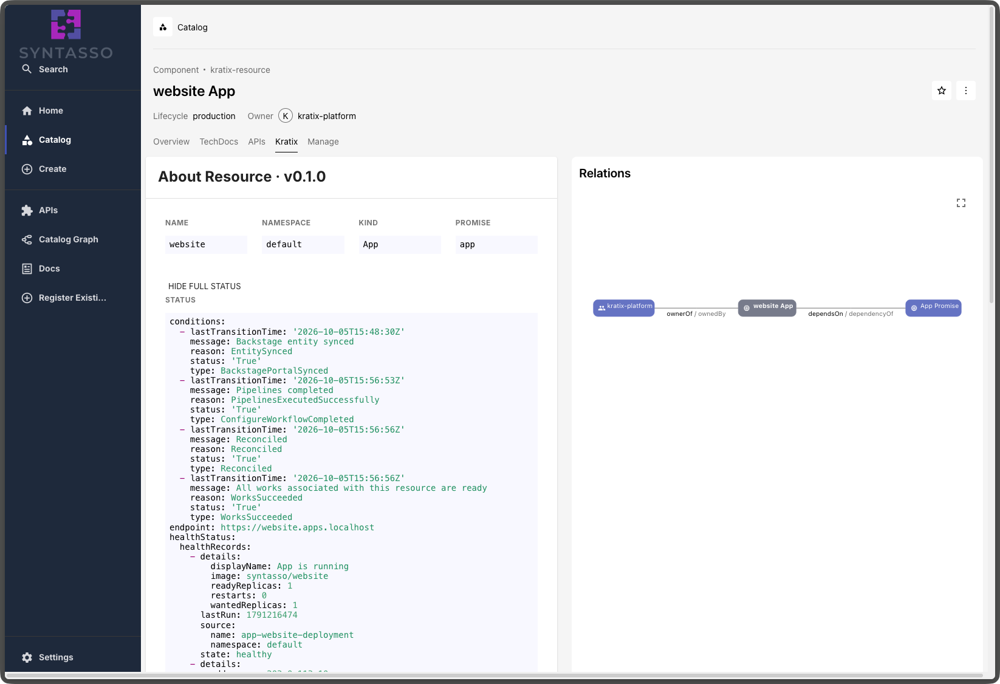
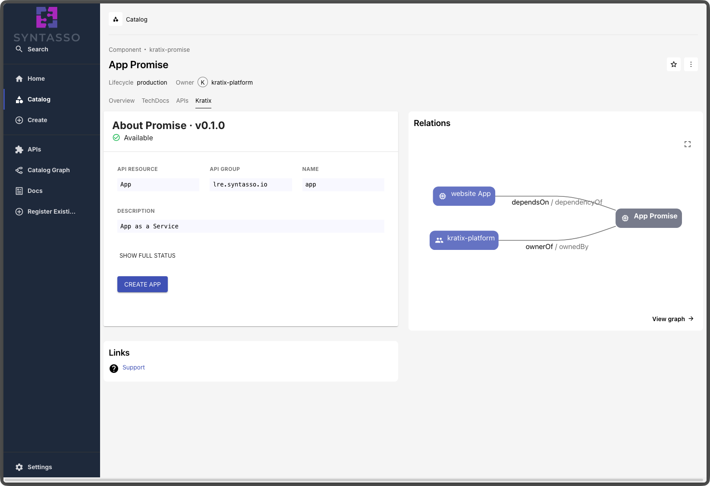
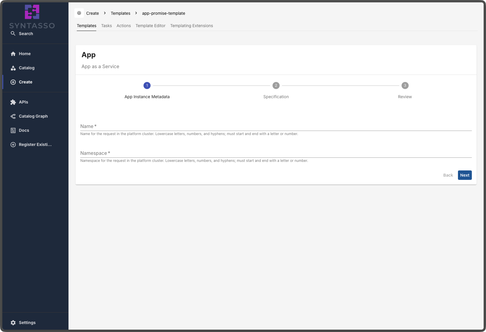
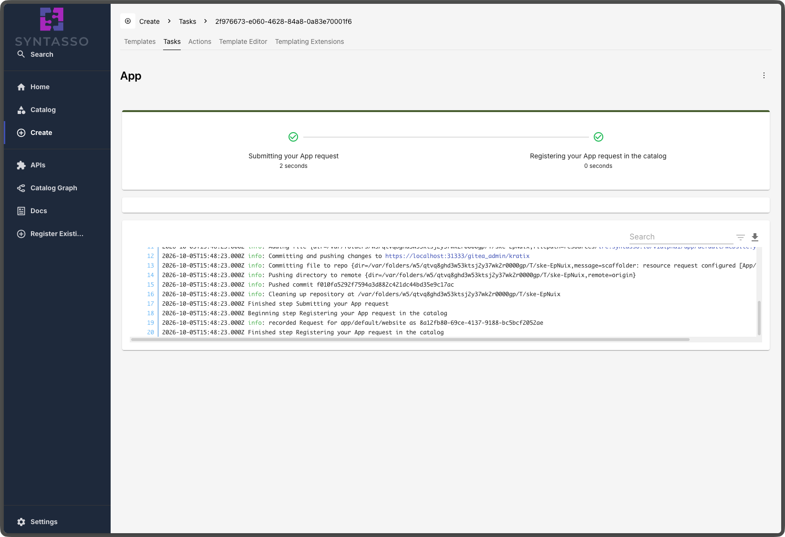
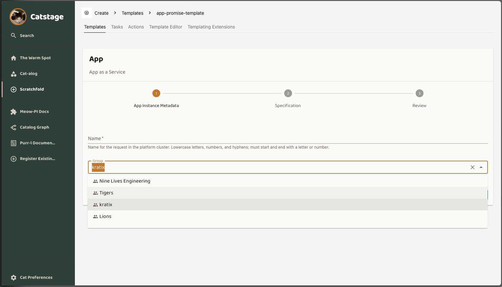
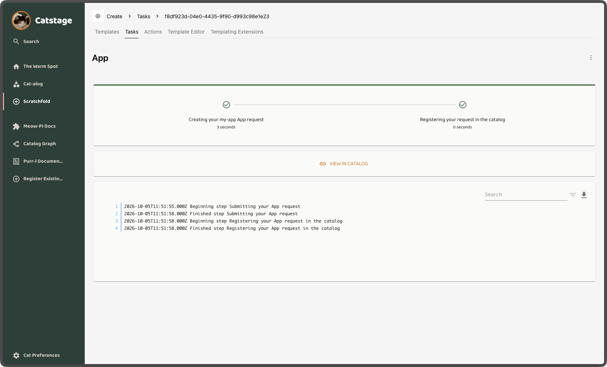
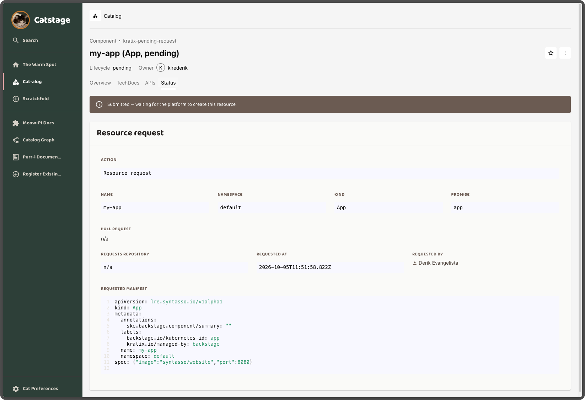
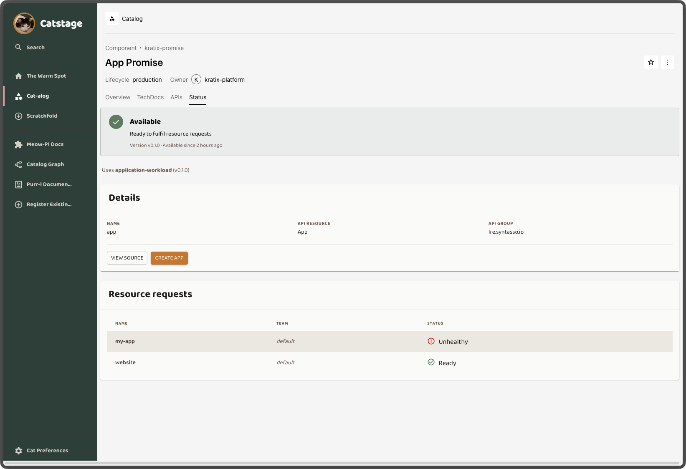
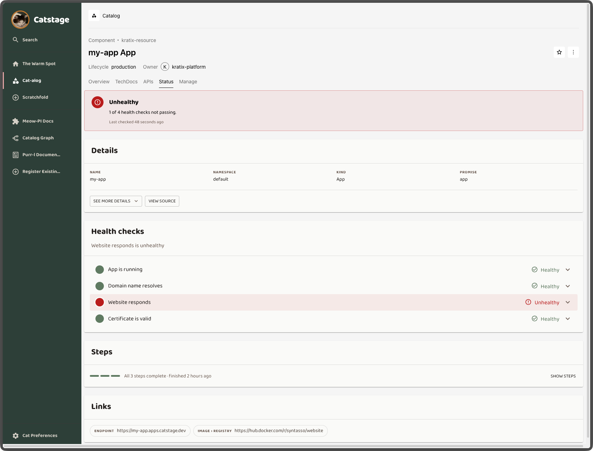

We at Syntasso are very proud of the SKE Backstage integration we built. You
apply a Promise, and a Component and a Template automagically appear in your
Backstage instance. You can send requests to the platform via GitOps or
directly via the Kubernetes API. Changes to the Promise regenerate the
Template. You can use an array of CRD properties to control the validation
applied to the form, and you can run custom containers to customise what the
platform generates.

It is great.

Except, it kinda looks like this:

Which is enough to get you started, but it won't necessarily _wow_ the
platform users. It solved the immediate problem for the platform engineer
(_how do I expose this service on Backstage?_), but it was quite simple on the
visual front. Apparently raw YAML is not everyone's cup of tea… not sure why.
it better.

In this post, we will explore why the interface matters and how it can drive
adoption of your platform. We'll look at what we had before, what we have
learned from our customers, and how we used that learning to improve the
out-of-the-box experience with Backstage. We will then look at what we have
just released to make it _even_ better.

{/* truncate */}

**TL;DR:** Syntasso Kratix Enterprise (SKE) automatically generates Backstage
Software Templates and catalog entities from your Kratix Promises. We have
redesigned this out-of-the-box Backstage experience. Request forms are clearer,
users pick a Backstage Group instead of a Kubernetes Namespace, and they get
immediate "Pending" feedback after submitting. New Promise and Resource pages
show health, status and provisioning progress at a glance, so platform users
can find, request and track services without reading YAML.

## Where we started: Backstage Software Templates generated from Kratix Promises

## Why the interface matters for platform adoption

A problem lots of platform teams face in their organisations is adoption: they
build a nice, self-contained, fully managed platform, full of amazing
services, and… no one uses it. Often it's not a lack of functionality. We see
this repeatedly with our customers, and some of the most commonly raised
barriers to adoption are:

- Developers don't know what's available in the platform.
- Developers don't know how to consume and monitor what they requested from
  the platform.
- Inertia is strong, and change is hard.

This is where portals like [Backstage](https://backstage.io) and
[Cortex](https://www.cortex.io) really help. A platform can be technically
excellent and still fail to gain adoption if it asks users to work in
unfamiliar ways. A portal like Backstage turns those capabilities into
discoverable, contextual artefacts: services, owners, environment lifecycles,
request forms and documentation, all in one central place. Users can go
through a wizard-like experience to request what they need, and quickly
understand when things go wrong.

> _What are you talking about? Developers want clear APIs, CLIs, and ways to
> use things with AI. GUIs are not it._

Hear me out, I'm right there with you. Your users will only use your platform
if they can integrate it with their existing workflows, and that often means
making it programmable and accessible via APIs. They will need CLI tools, and
MCP servers so their agents can consume the services. That's all true.

But as much as I love writing YAML, and as much as I find `kubectl` very
simple to use, they may not be the best tools to get people started.

> _Ah, but we have a GitOps flow where you can open a PR to a repository and…_

Sure. I'm certain it's great. But it adds more cognitive load for the platform
user than clicking buttons, especially when they have many other things on
their mind and just want access to the service they need. GUIs are familiar,
and
[recognition rather than recall](https://www.nngroup.com/articles/ten-usability-heuristics/)
is an important part of making systems more accessible.

Portals do not replace APIs, CLIs or GitOps. They complement them. A portal can
provide the easiest path into the platform, while more experienced users and
automated systems continue to use the interfaces that best fit their
workflows.

## What our original Backstage integration looked like (and where developers got stuck)

Of the three barriers above, our previous integration solved only service
discovery: a Promise is installed, the Backstage Template is generated, and
users can find the services in the Catalog. Users can see both a Component for
the Promise and a Template to create an instance of that Promise:

They can select the service they need, fill in the form, and create the
service:

Once the request is fulfilled, the user sees a Component for their service,
and can expand it to explore its status:

From the developer's point of view, the sharp edges show up quickly:

- What is a Namespace? What value should I write in there?
- The stepper on the Template uses Kratix-specific terms I don't understand.
  And what about these log lines?
- I clicked save. Where's my resource?

On the Resource page, things get even more confusing:

- Where can I see detailed information about my resource?
- What did I even request again?
- What is its status right now? Is it ready?
- Wow, that's a lot of YAML.

Still better than a terminal (maybe?). In our defence, a Backstage expert
could make it nicer using all the information that is ~~buried~~ in there,
and could
[customise the generated entities](/ske/integrations/portal-controller/customization).
However, platform teams are already responsible for so much, and we wanted to
make things **much** better.

## The out-of-the-box Backstage experience in SKE

We named the epic "Out-of-the-box Backstage". We wanted platform engineers and
platform users to get a user-ready experience from our integration, with
minimal configuration. Ideally, they install the
[Portal Controller](/ske/integrations/portal-controller/intro), configure the
[SKE Backstage plugins](/ske/integrations/portal-controller/backstage/intro),
and get something that is not only beautiful, but also clear and informative.

On the Template, we focused on:

- Making the language clearer, using terms developers already know.
- Providing better error messages, and showing log lines meant for the person
  reading them.
- Pointing the user to the resource they just created.
- Offering an alternative to the Namespace field, using terms closer to what a
  Backstage user knows. The Portal Controller can now
  [map the Backstage Groups a user belongs to onto Kubernetes Namespaces](/ske/integrations/portal-controller/backstage/request-namespace),
  either by group name or by a group annotation.

These small changes have already made a big difference to the developer
experience: no more guessing what fields mean, no more confusing output, and a
clear pointer to where to go next.

There is a delay between the user submitting a request and the integration
generating the Component for it. To give the user immediate feedback, we now
create a "Pending" catalog entity for the resource straight away:

The big changes are in the Component pages. Both the Promise and Resource pages
received a major revamp. From the Promise page, we wanted the portal user to be
able to see:

- Is the Promise currently available?
- What is the status and version of the Promise?
- Is this a Compound Promise?
- How many instances of this Promise are there? Who owns them? At a glance,
  are the resources healthy?

You can see the changes in the screenshot below:

From there, you can navigate to the Resource itself. For the Resource page, we
focused on answering these questions:

- At a glance, what's the state of my resource?
- What information is available to me about my resource?
- Is my resource healthy? If not, what is failing, and why?
- What's the status of the resource provisioning (or update)? If a stage
  failed, which one?
- What was my original request?

The resulting changes are all captured in the screenshot below:

As (I hope) you can see from the screenshots above, the out-of-the-box SKE
Backstage integration is now much better. It gives your users a more
compelling experience by tackling the discoverability and usability barriers
to adoption we discussed earlier.

Of course, you can still
[customise how SKE generates the Backstage entities](/ske/integrations/portal-controller/customization)
and hand-craft your Backstage experience to suit your organisation, but now you
have a much better head start.

## See the new Backstage integration in action

Your platform can be technically excellent and still go unused if developers
can't find what's on offer, request it confidently, and see what happened
next. With SKE, every Promise you apply becomes a polished, self-service
experience in Backstage: clear forms, instant feedback, and health and status
at a glance, all generated for you. Your platform team doesn't have to
hand-craft a single page.

Ready to make your platform the easy choice for developers?

- [**Book a demo**](https://calendly.com/hello-syntasso/book-time-with-syntasso)
  to see the new Backstage experience running on a live platform, and talk
  through how SKE can drive adoption in your organisation.
- [**Read the Portal Controller docs**](/ske/integrations/portal-controller/intro)
  to get set up, or to
  [customise the generated entities](/ske/integrations/portal-controller/customization)
  for your organisation.
- [**Join the Kratix community on Slack**](https://kratixworkspace.slack.com/)
  to tell us what you think. Do you see other barriers to adoption? Would you
  rather ship only CLIs? We're curious to hear from you, and your feedback
  shapes what we build next.
