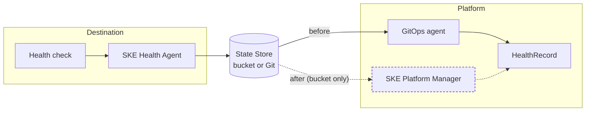

```mdx-code-block
import Tabs from '@theme/Tabs';
import TabItem from '@theme/TabItem';
```

Up until SKE version v0.58.0, the only way to get health records onto the Platform was a
GitOps agent reading them from the State Store. Starting with SKE version **v0.59.0**, the
SKE Platform Manager can read the records from a bucket itself, which removes the GitOps
agent from the health path entirely.

Which versions you need on the Destination depends on the kind of store, because the
component that writes to it lives in the SKE Health Agent. Every storage backend therefore
needs an agent release that can write to it:

* **S3-compatible**: nothing new. The agent has written to bucket State Stores for a long
  time, and the records it writes are unchanged.
* **Azure Blob Storage**: SKE Health Agent **v0.14.0** or above, the release that adds the
  Azure writer.

This guide migrates **one Destination** at a time, and is written so that health is never
missing at any step. You can stop after any step and be in a working state, and you can
undo any step you have taken.

**In this guide you will**

1. [Point the Destination's agent at a bucket](#point-the-agent) (the write side)
1. [Create a HealthSource on the Platform](#create-the-source) (the read side)
1. [Check the new path is working](#check-it-works)
1. [Remove the GitOps sync](#remove-the-sync)

## What changes

Only the last leg of the journey changes: how a record gets from the State Store onto the
Platform. Everything before it is the same, and the resource's `status.healthStatus` ends
up in the same shape either way, so nothing that consumes health can tell the difference.



The GitOps agent on the Platform leaves the health path entirely. The health agent on the
Destination stays exactly where it is, and keeps doing the same job.

Both of those last legs are what the
[Health Checks guide](/ske/guides/healthchecks#how-do-health-checks-work-in-ske) calls a
**HealthCheck Monitor**. This migration swaps one for the other, and changes nothing else.

### Three names for two sides of one bucket

`HealthSource` is **not** a new name for the State Store, and it does not replace it. They
are separate objects, on opposite sides, pointed at the same bucket:

| | Where it lives | What it is | Access |
| --- | --- | --- | --- |
| **State Store** (`health-state-store-config`) | Destination | How the health agent is told where to **write** records. Step 1 changes what it points at, never its role, and it may be Git or a bucket. | write |
| The **bucket** | Neither | The storage itself. Both sides name it, and it is the only thing they share. | — |
| **`HealthSource`** | Platform | A new object telling the SKE Platform Manager where to **read** records from. | read |

So after this migration the agent is still writing to a State Store, exactly as before. What
is new is a `HealthSource` on the Platform reading the same bucket, in place of a GitOps
agent syncing it.

A `HealthSource` deliberately does not reference a Kratix `BucketStateStore`, even when one
already points at the same bucket. That is [the permission split](#permissions), and it is
the next thing to get right.

## Why you might want this

Two reasons, and only the first is likely to be why you are here:

- **ArgoCD cannot reconcile from a bucket**, and
  [may never be able to](https://github.com/argoproj/argo-cd/issues/2558). If you run
  ArgoCD, delivering health through a State Store today means running Flux alongside it just
  for the `health/` path. Reading the bucket in the Platform Manager removes that.
- **Git history grows without bound.** Every execution of every health check produces a
  new `HealthRecord`, because the record carries the timestamp of the run under
  `data.lastRun`. On Git, that is a commit per check per resource, forever.

:::note

The Git path is not deprecated, and nothing here is required. If you are happy with your
GitOps agent syncing health records, you can keep it. This is an additional option.

:::

:::warning

If you rely on Git commits to map the history of a resource's health, you lose that when you
migrate to a bucket. A bucket keeps only the current record for each resource, overwritten in
place. Use metrics in a time-series database if you need health over time.

:::

## Before you start

You will need:

- A Destination already reporting health through a State Store, following the
  [Health Checks guide](/ske/guides/healthchecks).
- An S3-compatible bucket, or an Azure Blob Storage container, that the Destination can
  write to and the Platform can read. For
  Azure you also need SKE Health Agent v0.14.0 or above on the Destination; for an
  S3-compatible bucket any agent version that already writes to one will do.
- **An SKE new enough (version v0.59.0 or above) to have the reader.** There is nothing separate to install and no
  extra RBAC to grant: the SKE Platform Manager reads the bucket, and the `HealthSource` CRD
  and its permissions ship with it. An older SKE will not have it, so check before you plan
  anything:

  ```bash
  kubectl get crd healthsources.platform.syntasso.io
  ```

  :::note

  If that returns `NotFound`, upgrade SKE first. Nothing else in this guide will work without
  it, and Step 2 is where you would find out.

  :::

What you will do is create one `HealthSource` per Destination, and grant two separate
sets of credentials. Which brings us to the part worth getting right first.

:::warning If your health records are in Git today

**The SKE Platform Manager can only read health records from a bucket.** A `HealthSource`
takes a `spec.bucket` and nothing else; there is no Git equivalent. Git records reach the
Platform the way they always have, through a GitOps agent, and that path is not going away.

The [SKE Health Agent](/ske/installing-ske/ske-health-agent) still supports both, so this is
not a limitation you hit on the Destination. It only applies to the Platform's side of the
handover.

So if you are on Git, this migration is a bigger change than repointing the Platform: Step 1
also moves the records from a Git repository into a bucket. Health stays available
throughout, and the order is unchanged, but plan for a new bucket and a new write credential
rather than reusing what the agent has.

:::

## The permission split {#permissions}

The two sides of this path need different access, and deliberately so:

| Side | Needs | Why |
| --- | --- | --- |
| The **Destination** ([SKE Health Agent](/ske/installing-ske/ske-health-agent)) | **write** to the bucket | It puts a record file per resource, and deletes it when the resource goes. |
| The **Platform** (SKE Platform Manager) | **read** the bucket | It reads the `HealthRecord`s from the bucket. It never writes to it. |

The credential you give a `HealthSource` only needs permission to **list and get** objects
under its `spec.path`. Give it nothing more.

:::tip Recommended shape

If you already have a Kratix `BucketStateStore` pointing at this bucket, **do not reuse its
credential for the `HealthSource`**. A State Store must hold a credential Kratix can write
with, and one State Store usually serves the whole fleet.

Instead, create a **second** credential and reference that from the `HealthSource`. A
`HealthSource` deliberately carries its own credential rather than referencing a
`BucketStateStore`, so that one Destination's credential cannot reach another Destination's
records.

On an S3-compatible store, make that credential read-only: it needs nothing beyond list and
get on `spec.path`.

:::

:::warning Azure Shared Key cannot be read-only

Under `provider: azure` the reader authenticates with a storage-account key, and that is its
only option. A Shared Key authorises full read **and write** access to everything in the
storage account. It cannot be reduced to read-only, and it cannot be scoped to one container
or prefix.

So on Azure the permission split above is what the Platform *uses*, not what the credential
*enforces*. The reader only ever lists and gets, but the key you give it could do more. Limit
the blast radius instead: use a storage account dedicated to health records, so a key that
leaks reaches only health records, and keep it out of anything that also holds Kratix state.

:::

## Order of operations

**The order below is the point of this guide.** Bucket first, source second, check third,
remove the GitOps sync last.

Any other order leaves a window where health is missing from the Platform. If you remove
the GitOps sync before the new path is confirmed working, every resource on that Destination
loses its health status until you have finished. If anything gates on health, such as an
[UpgradeRun](/ske/guides/promise-upgrades), it will then be acting on missing data.

Running both paths at once is supported. That overlap is what makes this safe, and
[what you see during it](#the-overlap-window) is described below.

## Step 1: Point the Destination's agent at a bucket {#point-the-agent}

On the **Destination**, the agent's `health-state-store-config` ConfigMap in the
`k8s-health-agent-system` namespace decides where records are written. Set it to a bucket.

<Tabs className="boxedTabs" groupId="bucketProvider">
  <TabItem value="s3" label="S3-compatible">

  ```yaml
  apiVersion: v1
  kind: ConfigMap
  metadata:
    name: health-state-store-config
    namespace: k8s-health-agent-system
  data:
    stateStoreKind: BucketStateStore
    endpoint: # address, without a scheme
    bucketName: # bucket name
    authMethod: accessKey # or IAM (default: accessKey)
    secretName: health-store-writer # required for accessKey
    path: health/worker-1 # the prefix this Destination writes under
    destinationName: worker-1 # see the warning below
  ---
  apiVersion: v1
  kind: Secret
  metadata:
    name: health-store-writer
    namespace: k8s-health-agent-system
  stringData:
    accessKeyID: # Access Key ID, with write access
    secretAccessKey: # Secret Access Key
  ```

  </TabItem>

  <TabItem value="azure" label="Azure Blob Storage">

  ```yaml
  apiVersion: v1
  kind: ConfigMap
  metadata:
    name: health-state-store-config
    namespace: k8s-health-agent-system
  data:
    stateStoreKind: BucketStateStore
    provider: azure
    endpoint: https://<account>.blob.core.windows.net # the storage-account URL
    bucketName: # the container name
    authMethod: sharedKey # azure's only method
    secretName: health-store-writer
    path: health/worker-1
    destinationName: worker-1
  ---
  apiVersion: v1
  kind: Secret
  metadata:
    name: health-store-writer
    namespace: k8s-health-agent-system
  stringData:
    accountKey: # the storage-account key
  ```

  :::warning

  Storage accounts with **hierarchical namespace (HNS / ADLS Gen2)** enabled are not
  supported. Use a standard blob storage account.

  :::

  </TabItem>
</Tabs>

The agent writes one flat file per resource under `path`, named after the Promise,
namespace, resource and Destination.

:::warning Set `destinationName` if Destinations share a prefix

Without `destinationName`, agents on two Destinations checking the same resource generate
the **same** file name and overwrite each other in the bucket. Either give each Destination
its own `path`, or set `destinationName`. If in doubt, do both. See
[Running the agent on multiple Destinations](/ske/installing-ske/ske-health-agent#running-the-agent-on-multiple-destinations).

:::

Health is still present on the Platform at this point, but understand exactly what has
changed. The agent now writes to the new bucket, so if the old State Store was a different
bucket or a Git repository, **the records there stop being updated**. Your GitOps sync keeps
applying them, so nothing disappears. They are frozen at their last value, though, and
their `lastRun` stops advancing.

That is safe, and it is why the next steps are short. It is also the reason not to leave the
overlap window open for long: because [the worse state wins](#the-overlap-window), a frozen
record that last reported `unhealthy` will keep the resource reading `unhealthy` even after
the new path reports it healthy. Move on to Step 2 rather than leaving a Destination here.

## Step 2: Create a HealthSource on the Platform {#create-the-source}

On the **Platform**, a `HealthSource` names one place to read records from: one bucket, one
prefix, one credential of its own. Create one per Destination.

One source *can* read a prefix holding several Destinations' records, and they stay distinct
because their object keys differ. Prefer one source per Destination anyway: it is what keeps
one Destination's credential from reaching another Destination's records, and it lets a
single Destination's health path fail on its own rather than taking the fleet's with it.

<Tabs className="boxedTabs" groupId="bucketProvider">
  <TabItem value="s3" label="S3-compatible">

  ```yaml
  apiVersion: v1
  kind: Secret
  metadata:
    name: health-store-reader-worker-1
    namespace: default
  stringData:
    accessKeyID: # read-only Access Key ID
    secretAccessKey: # read-only Secret Access Key
  ---
  apiVersion: platform.syntasso.io/v1alpha1
  kind: HealthSource
  metadata:
    name: worker-1
  spec:
    bucket:
      endpoint: # same endpoint the agent writes to, without a scheme
      bucketName: # same bucket
      authMethod: accessKey # or IAM
      secretRef:
        name: health-store-reader-worker-1
        namespace: default
    path: health/worker-1 # the same prefix the agent writes under
    pollInterval: 10m
  ```

  </TabItem>

  <TabItem value="azure" label="Azure Blob Storage">

  ```yaml
  apiVersion: v1
  kind: Secret
  metadata:
    name: health-store-reader-worker-1
    namespace: default
  stringData:
    accountKey: # the storage-account key: see the warning below
  ---
  apiVersion: platform.syntasso.io/v1alpha1
  kind: HealthSource
  metadata:
    name: worker-1
  spec:
    bucket:
      provider: azure
      endpoint: https://<account>.blob.core.windows.net
      bucketName: # the container name
      authMethod: sharedKey
      secretRef:
        name: health-store-reader-worker-1
        namespace: default
    path: health/worker-1
    pollInterval: 10m
  ```

  </TabItem>
</Tabs>

`HealthSource` is cluster-scoped, and its name labels every record it applies, so keep the
name short and recognisable: the Destination's name is a good choice.

:::tip Keep `spec.path` tight

The reader can only discover that an object is not a health record by fetching it. A prefix
that also covers unrelated objects costs one fetch per unrelated object every time one of
them changes.

:::

## Step 3: Check the new path is working {#check-it-works}

Do not skip this step. It is the whole reason the order above is safe. Everything here runs
against the **Platform** cluster, and only reads.

First, the source itself:

```bash
kubectl get healthsources
```

```console
NAME       BUCKET   READY   REASON           OBSERVED   LAST GOOD POLL   AGE
worker-1   kratix   True    PollSucceeded    14         12s              2m
```

You are looking for `READY=True`, an `OBSERVED` count that matches the number of resources
this Destination reports on, and a recent `LAST GOOD POLL`. If `READY` is not `True`, the
`REASON` column names the thing at fault. See [Troubleshooting](#troubleshooting).

For the full picture, including how many records the last poll applied and failed:

```bash
kubectl describe healthsource worker-1
```

Next, confirm the records themselves arrived. Every record the reader applies is labelled
with its source:

```bash
kubectl get healthrecords -A -l platform.syntasso.io/health-source=worker-1
```

Each of those carries the object key it came from, which is how you tie a record back to a
file in the bucket:

```bash
kubectl get healthrecord <name> -n <namespace> \
  -o jsonpath='{.metadata.annotations.platform\.syntasso\.io/object-key}'
```

Finally, and most importantly, check a resource still reports the health you expect:

```bash
kubectl get <resource> <name> -n <namespace> -o jsonpath='{.status.healthStatus}' | jq
```

At this point you should see **two** records for the resource, which is expected and is
covered next.

## The overlap window {#the-overlap-window}

While both paths are running, **a resource shows two health records**: one delivered by
your GitOps agent, one applied by the reader. This is normal. If you see it and have not
been told to expect it, it looks like something is broken, and the temptation is to roll
back.

They coexist rather than fight because they have different object names. The agent names
the records it writes after the Promise, namespace and resource, with no source in the
name. The reader instead derives a name from its own `HealthSource` name and the object
key, so the two never collide.

Kratix's aggregation lists both, and **the worse state wins**. Kratix orders states worst
to best:

```text
unhealthy → degraded → unknown → healthy → ready
```

and `status.healthStatus.state` takes the worst state across every record for that
resource, while `status.healthStatus.healthRecords` lists them all with their `source`.

This is what makes the overlap safe: while both paths report, the resource cannot appear
healthier than the worst thing either path knows about. It fails towards caution.

It cuts the other way too, and this is the one thing to watch. From Step 1 onwards the old
record is **frozen** (the agent no longer updates it), so it reports whatever it last saw,
forever. If that last value was `unhealthy`, the resource keeps reading `unhealthy` however
healthy the new path says it is, until Step 4 removes the old record. Compare `lastRun`
between the two records in `status.healthStatus.healthRecords` to tell a live disagreement
from a stale one:

```bash
kubectl get <resource> <name> -n <namespace> \
  -o jsonpath='{range .status.healthStatus.healthRecords[*]}{.source.name}{"\t"}{.state}{"\t"}{.lastRun}{"\n"}{end}'
```

The record whose `lastRun` is advancing is the new path. The one that has stopped is the old
one, and it goes in Step 4.

:::info The Git record goes when its sync goes

The reader will never delete the records your GitOps agent applied. Its listing and its
pruning are both scoped to the `platform.syntasso.io/health-source` label it sets itself,
so it cannot touch a record it did not apply.

That is deliberate, and it is what makes running both paths safe. It has a consequence,
though: the old records do not disappear on their own. They go when the GitOps sync that maintains
them goes, in Step 4.

:::

## Step 4: Remove the GitOps sync {#remove-the-sync}

Only once Step 3 looks right. Removing the sync while it still has `prune: true` and still
owns those records is what deletes them, which is exactly what you want. It is also exactly
what you do not want if the new path is not yet working.

:::danger Check which cluster and which sync

Everything in this step runs against the **Platform** cluster, and targets only the sync
that reads health records **into** the Platform.

There is usually a GitOps agent on the Destination too, and it does an unrelated job: it
applies the `HealthDefinition`s that tell the health agent what to check, along with every
other workload Kratix schedules there. Removing that one stops the health checks running at
all, and takes the Destination's other workloads with it.

Confirm your context before you delete anything:

```bash
kubectl config current-context
```

:::

<Tabs className="boxedTabs" groupId="gitopsAgent">
  <TabItem value="argo" label="ArgoCD">

  If health was the only reason you ran a GitOps agent against this State Store, remove the
  Application that syncs the health path:

  ```bash
  argocd app delete health-records --cascade
  ```

  Deleting the Application has to **cascade**, or it goes away and leaves its
  `HealthRecord`s behind. Automated pruning does not do this for you: it governs ongoing
  reconciliation, not what happens when the Application is removed. A cascading delete
  requires the `resources-finalizer.argocd.argoproj.io` finalizer on the Application, which
  `argocd app delete --cascade` adds for you. See ArgoCD's
  [Application Deletion](https://argo-cd.readthedocs.io/en/stable/user-guide/app_deletion/)
  documentation.

  If you delete it with `kubectl` instead, add that finalizer first, then confirm the
  records really are gone with the check below rather than assuming.

  If the Application syncs more than health, narrow its source rather than deleting it:
  remove the health path from `spec.source.path` (or from the directory include) and sync.

  :::note

  If ArgoCD is the reason you are here, this is the step that pays for the migration: once
  the health path is gone, you no longer need Flux alongside ArgoCD, and you can remove that
  too.

  :::

  </TabItem>

  <TabItem value="flux" label="Flux">

  Remove the `Kustomization` that syncs the health path, and the `GitRepository` behind it
  if nothing else uses it:

  ```bash
  kubectl delete kustomization health-records -n flux-system
  kubectl delete gitrepository health-records -n flux-system
  ```

  The `Kustomization` being removed looks like this, where `prune: true` is what removes the
  old records with it:

  ```yaml
  apiVersion: kustomize.toolkit.fluxcd.io/v1
  kind: Kustomization
  metadata:
    name: health-records
    namespace: flux-system
  spec:
    interval: 3s
    sourceRef:
      kind: GitRepository
      name: health-records
    path: "health"
    prune: true
  ```

  </TabItem>
</Tabs>

Then confirm each resource is down to one record, delivered by the reader:

```bash
kubectl get <resource> <name> -n <namespace> -o jsonpath='{.status.healthStatus}' | jq
```

If the old records outlive their sync, because pruning was off or a delete did not cascade,
delete them yourself. They are the ones **without** the source label, so list them first:

```bash
kubectl get healthrecords -A -l '!platform.syntasso.io/health-source'
```

:::warning Read that list before deleting it

An unlabelled record means "not applied by a `HealthSource`", which covers the stale records
you want gone **and** the live records of every Destination you have not migrated yet. During
a fleet migration those look identical.

Check the list is only the Destination you just migrated. Then delete by name:

```bash
kubectl delete healthrecord <NAME> -n <NAMESPACE>
```

Deleting them by label in one command will take the health of every unmigrated Destination
with it.

:::

Leaving a stale record in place is not cosmetic: it is frozen, so if it last reported
`unhealthy` it keeps [pinning the resource unhealthy](#the-overlap-window).

That Destination is now migrated.

## Migrating a fleet {#fleet}

Steps 1 to 4 cover one Destination, and that is the unit of this migration. There is no
fleet-wide switch: each Destination needs its own `HealthSource` and its own credential,
which is the same property that stops one Destination's credential reaching another's
records.

So the fleet migration is the four steps, repeated. Two things make that safer than doing
them in bulk:

1. **Take one Destination all the way through first**, and prefer a non-production one. The
   parts most likely to bite are environmental rather than conceptual: endpoint reachability
   from the Platform, whether the credential has the access it needs, whether `spec.path` matches
   what the agent writes. You want to meet those once, not across the fleet at the same time.
2. **Then go one Destination at a time.** Nothing is shared between them, so a Destination
   that goes wrong is contained, and Step 4 is still the last thing you do for each.

To see how far along you are, list the sources and check each is `Ready`:

```bash
kubectl get healthsources
```

A Destination with no `HealthSource` has not been migrated. To find records still arriving
the old way, across every Destination, look for the ones with no source label:

```bash
kubectl get healthrecords -A -l '!platform.syntasso.io/health-source'
```

Once that returns nothing and every source reads `Ready=True`, the whole fleet is on the new
path, and no GitOps agent is syncing health any more.

:::tip

Do not leave the fleet half-migrated for longer than you have to. It is a supported state,
but every Destination still in the overlap has a
[frozen record that can pin a resource unhealthy](#the-overlap-window), and that is easy to
misread weeks later when you have forgotten which Destinations are mid-migration.

:::

## Undoing a step {#rollback}

At every step, the way back is short:

| After | To undo |
| --- | --- |
| Step 1 | Point the agent's ConfigMap back at the old State Store. |
| Step 2 | `kubectl delete healthsource <name>`. Every record it applied is garbage collected with it, because each one is owned by the source. |
| Step 3 | Nothing to undo: it only reads. |
| Step 4 | Restore the GitOps `Application` or `Kustomization` you removed. It re-applies the records from the State Store. |

Because the GitOps sync is untouched until Step 4, undoing Steps 1 to 3 leaves you exactly
where you started, with health still flowing.

## Troubleshooting {#troubleshooting}

When a poll fails, `Ready` goes `False` with a reason that names the thing at fault. The
reason is the next place to look, not the controller logs. A poll that works clears it.

| Reason | What it means | Where to look |
| --- | --- | --- |
| `PollSucceeded` | `Ready=True`. The source was read and everything in it applied. | — |
| `SourceMisconfigured` | The spec itself is not usable: for example an `authMethod` the provider does not support, or a missing `secretRef`. | `spec.bucket` |
| `CredentialsUnavailable` | There is nothing to authenticate with: the Secret is missing, or missing a key. | The Secret in `spec.bucket.secretRef` |
| `CredentialsRejected` | The store was given credentials and refused them. | The keys themselves, and their permissions |
| `BucketNotFound` | The bucket or container does not exist at that endpoint. | `spec.bucket.bucketName` and `endpoint` |
| `SourceUnreachable` | The listing failed for another reason, such as network, DNS or TLS. | Connectivity from the Platform to the endpoint |
| `RecordsUnreadable` | The listing worked, but some objects could not be read or parsed. Usually a `spec.path` that is too broad and covers objects that are not health records. | `spec.path`, and `status.recordsFailed` |
| `PlatformUnavailable` | The records were read, but applying them to the Platform failed. | The Platform's own API |

A source that keeps failing backs off: the gap between attempts doubles from
`spec.pollInterval`, up to 30 minutes, or up to `spec.pollInterval` itself if you have set it
longer than that. One Warning Event covers the run of failures rather than one per
attempt. When the reason changes, the backoff resets, because a different fault is a fresh
problem rather than a continuation of the old one.

Two behaviours worth knowing, because both look like faults and neither is:

- **`recordsApplied` settling at 0 is correct.** Only records whose object revision has
  changed are fetched and applied, so a Destination whose health is steady polls to zero.
  Watch `lastSuccessfulPollTime`, not `recordsApplied`.
- **An empty listing prunes everything from that source.** The agent removes a record file
  when the resource it reports on goes. A prefix with no objects therefore means that
  Destination has stopped reporting, and every record the source applied is removed.
  Pruning only happens on a listing that completed, so a failed poll never deletes anything.

## HealthSource reference {#reference}

`HealthSource` is cluster-scoped. Its name must be at most 63 characters, because it labels
every record the source applies.

### `spec`

| Field | Type | Description |
| --- | --- | --- |
| `bucket` | object | **Required.** The object store to read from. See [`spec.bucket`](#spec-bucket). |
| `path` | string | The prefix within the bucket to read, matching the `path` the agents writing here are configured with. Everything below it is read recursively, so it may hold a directory per Destination or record files directly. Keep it tight. |
| `pollInterval` | duration | How often the source is listed. Minimum `1s`. Default `10m`. |

### `spec.bucket` {#spec-bucket}

| Field | Type | Description |
| --- | --- | --- |
| `endpoint` | string | **Required.** Under `generic`, a bare host with no scheme. Under `azure`, the storage-account URL (`https://<account>.blob.core.windows.net`); a bare host gets `https` unless `insecure` is set. |
| `bucketName` | string | **Required.** The bucket to read from; under `azure`, the container. |
| `provider` | enum | `generic` for any S3-compatible store, `azure` for Azure Blob Storage. Default `generic`. |
| `authMethod` | enum | `accessKey`, `IAM`, or `sharedKey`. `accessKey` and `sharedKey` read from `secretRef`; `IAM` uses the ambient instance identity. `sharedKey` is `azure`'s only method, and `azure`'s only. Omitted means `accessKey` under `generic` and `sharedKey` under `azure`. |
| `secretRef` | object | `name` and `namespace` of the Secret holding the credentials. Required for every `authMethod` except `IAM`, which ignores it. Keys are `accessKeyID` and `secretAccessKey` for `accessKey`, or `accountKey` for `sharedKey`. The reader only ever lists and gets under `spec.path`, though an Azure `sharedKey` cannot itself be restricted to that. |
| `insecure` | boolean | Connect over HTTP rather than HTTPS. Under `azure` it applies only when the endpoint omits a scheme; an endpoint that spells one keeps it. Default `false`. |
| `useDualStack` | boolean | Opt in to Amazon's dual-stack endpoints. Off by default, because they are unreachable from IPv4-only VPCs. No effect on non-Amazon endpoints, and not supported under `azure`. |

### `status`

| Field | Type | Description |
| --- | --- | --- |
| `conditions` | array | `Ready` is `True` once a poll has read the source and applied everything in it. `False` carries one of the reasons in [Troubleshooting](#troubleshooting). |
| `observedGeneration` | integer | The generation of the spec the last poll acted on. |
| `lastPollTime` | timestamp | When the source was last listed, successfully or not. |
| `lastSuccessfulPollTime` | timestamp | When a poll last read the source and applied what it read. Unlike `lastPollTime` it does not move when a poll fails, so the gap between the two is how long this source's records have been stale. |
| `recordsObserved` | integer | The number of keys the last successful listing returned. |
| `recordsApplied` | integer | The number of records the last poll applied. Steady state is `0`. |
| `recordsFailed` | integer | The number of keys the last poll could not read or parse. |

### Metadata on applied records

Every `HealthRecord` the reader applies carries:

| Key | Description |
| --- | --- |
| `platform.syntasso.io/health-source` (label) | The name of the `HealthSource` that applied it. Scopes everything the reader does, so it can never touch a record it did not apply. |
| `platform.syntasso.io/object-key` (annotation) | The object key in the bucket the record was read from. |
| `platform.syntasso.io/object-revision` (annotation) | The object revision that was read, which is how the reader decides whether to fetch again. |

Each record is also owned by its `HealthSource`, so deleting the source garbage collects
every record it applied.
